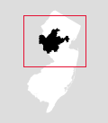
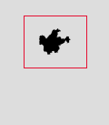
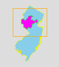

Data News Minimapper
====================

The WNYC Data News team used this generator to make the minimaps for our [2014 election results page](http://project.wnyc.org/election2014/).

It uses PhantomJS and a dummy webpage to draw a D3 map and save it as an image.

The example configuration will draw minimaps of New Jersey House of Representatives districts.

# Quick start

1. Install [PhantomJS](http://phantomjs.org/).
2. Get at least one GeoJSON file with the features you want minimaps for (see "Data").
3. Edit `config.json` with your options (see "Configuration").
4. Edit `style.css` with your preferred colors and styles (see "Styling").
5. Run `phantomjs render.js` from your Terminal.

That's it!

You can also preview what the minimaps will look like directly by viewing `generate.html` in a browser (see "Previewing").

If you have questions, [ask us](https://twitter.com/veltman)!

# Data

Your minimaps will be drawn based on GeoJSON files.  You can supply two:

* a **foreground** file.  This should have each feature you want to highlight.  If you want a minimap of New Jersey house districts, this should be a GeoJSON file of those districts.  THIS IS REQUIRED.
* a **background** file.  This will be used to draw a background layer under the highlighted feature.  This will be the same for each minimap in the set.  So, if you want a minimap of New Jersey house districts, this could be the entire state of New Jersey.  This is optional.

Without a background file:

With a background file:

You need to set the path to each file in `config.json`:

    "backgroundFile": "geo/NJ-background.geojson",
    "foregroundFile": "geo/NJ-house.geojson"

The foreground and background can both be the same file:

    "backgroundFile": "geo/NJ-house.geojson",
    "foregroundFile": "geo/NJ-house.geojson"

But if you do that, you may get weird little border artifacts in the background, so it's probably better to use a background file that merges everything into one feature (e.g. the whole state of New Jersey as a single feature).

# Configuration

In `config.json`, you set the options that will determine how your maps look.  Here's a minimum example config:

    {
      "foregroundFile": "geo/NJ-house.geojson",
      "url": "http://localhost/minimaps/generate.html",
      "width": 120,
      "height": 137
    }

This will produce a 120x137 PNG minimap for each house district in New Jersey, saved as `0.png`, `1.png`, `2.png`, etc.

Here's a config with more options:

    {
      "foregroundFile": "geo/NJ-house.geojson",
      "backgroundFile": "geo/NJ-background.geojson",
      "url": "http://localhost/minimaps/generate.html",
      "width": 120,
      "height": 137,
      "padding": 10,
      "propName": "House District",
      "outputPrefix": "png/NJ-house",
      "useBoxes": true,
      "format": "gif"
    }

## Required parameters

--------

`foregroundFile`

The path to the GeoJSON with your highlightable feature(s) in it.

--------

`url`

A URL (either local or remote) where `generate.html` can be loaded.

--------

`width`

The width for each image, in pixels.

--------

`height`

The height for each image, in pixels.

--------

## Optional parameters

--------

`backgroundFile`

The path to the GeoJSON with your background feature(s) in it.

If this is not set, there is no background layer.

--------

`padding`

A minimum padding, in pixels, between the edge of your map and the actual edge of the image.  You may want some buffer, especially if you're including `useBox` to draw rectangles around them, some of which will extend beyond the map.

If this is not set, the minimum padding is 0.

--------

`propName`

What property name should each feature's image be saved with?  If you set:

    "propName": "county"

and your feature has:

    {
      "type": "Feature",
      "properties": {
        "county": "Rockland"
      },
      "geometry": ...
    }

You will end up with a file named `Rockland.png` for that feature.

If you don't supply this, images will be saved with sequential numbers (`0.png`, `1.png`, etc.).

--------

`outputPrefix`

You can include a prefix at the start of each filename.  For example, if you want to save files to the `png/` subfolder and you want each file to start with "counties-" you can use:

    "outputPrefix": "png/counties-"

--------

`useBoxes`

Set this to true to draw a box around each feature.  You can style the box (see "Styling").

--------

`format`

What image format to save as. This can be `png`, `gif`, `jpeg`, or `pdf`.  Default is `png`.

--------

# Styling

In the example config, the background is white, the district is black, and the rectangle around it is a 1px red box. You can change all of these things by editing `style.css`.

Changing the value of `stroke` will change the color of the border around something.

Setting `stroke-width` will determine the width of that border.

Setting `fill` will change the fill color.

For example:

    .background {
      stroke: yellow;
      fill: skyblue;
    }

    .foreground {
      fill: fuchsia;
      stroke: lime;
    }

    .box {
      stroke-width: 1px;
      stroke: orange;
    }

You can set an overall background color for the image by changing the body's background color:

    body {
      background-color: white;
    }

The default is transparent, which is only supported if your format is `png` or `gif`.  If you're making `jpg`s instead, make sure to set a background color.

# Previewing

If you want to preview your maps, you can load `generate.html` with a `preview` parameter:

    generate.html?preview

This will rotate every 500ms, cycling through each map indefinitely, as a quick preview.

If you want to preview the map for a specific feature, you need to supply the value for `propName` (if that's been configured), or the zero-based index of the feature:

    //"propName": "county"
    generate.html?preview=Rockland
    
    //No propName in config.json, just preview the first feature
    generate.html?preview=0

    //No propName in config.json, just preview the second feature
    generate.html?preview=1

# About file size

Technically, if you want to hyperefficient, you might want to render a separate PNG for the background layer (the state) and the foreground (the district), and then show them as layers.  This would shave off a little bit of file size by not duplicating the state in every file.  On the other hand, our way is a lot easier, and as long as you minify the PNGs with something like [imagemin](https://www.npmjs.org/package/imagemin), they're only like 2k each so do you really need to shave this particular yak?