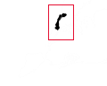

Data News Minimapper
====================

The WNYC Data News team used this generator to make the minimaps for our [2014 election results page](http://project.wnyc.org/election2014/).

It's currently set up to draw minimaps for New Jersey house districts, New York house districts, New York state assembly districts, New York state senate districts.  It can be customized for any other state or type of district (see below).

# The really short version

`generate.html` draws a map based on GeoJSON files.  `render.js` is a [PhantomJS](http://phantomjs.org/) script that loads that page and uses it to draw a map for each district and save it as a PNG.

Read those two files to get an idea of how it works.  Every instance where you'd want to customize it is marked with a comment that says `CHANGE THIS`.

If you have questions, [ask us](https://twitter.com/veltman)!

# The pretty short version

`generate.html` needs to be servable by a web server (e.g. http://localhost/minimaps/generate.html)

`generate.html` will generate an SVG map using D3.  You can style the maps (see below).  It takes a "state" and "type" parameter to tell it what kind of map you're drawing.

    generate.html?state=NY&type=house

`generate.html` expects two GeoJSON files named:

    geo/[STATE]-statewide.geojson (used for the backdrop)
    geo/[STATE]-[type].geojson (used to highlight districts)

So, for instance, if we want to do house, senate, and state assembly, in California, we could have:

    geo/CA-statewide.geojson
    geo/CA-house.geojson
    geo/CA-senate.geojson
    geo/CA-state-assembly.geojson

The "type" can be whatever you want, as long as its name in the GeoJSON file is the same as in `render.js` (see below).

Each GeoJSON feature needs to have a property called `di` with the district number (you can change this, see below).

After installing [PhantomJS](http://phantomjs.org/), you can run `render.js`:

    $ phantomjs render.js

This will cycle through any map types you've defined inside `render.js`, and then, for each type, cycle through each district, rendering a minimap out to a separate PNG by district number.

So you will get:

    png/CA-house-1.png
    png/CA-house-2.png
    etc.
    png/CA-senate-1.png
    png/CA-senate-2.png
    etc.
    png/CA-state-assembly-1.png
    png/CA-state-assembly-2.png
    etc.

# The long version

First, you need to install [PhantomJS](http://phantomjs.org/).

Then, you need at least two GeoJSON files: a foreground (the districts), and a background (the whole state):

The background file should be saved as `geo/[STATE]-statewide.geojson` and have a FeatureCollection with one feature in it, the entire state.  The properties of that feature don't matter.

The foreground files should be saved as `geo/[STATE]-[TYPE OF DISTRICT].geojson` and have a FeatureCollection with any number of features in it, one per district.  Each district should have a property with the district number or name.  Currently the code assumes that property is called `di`:

    {
      "type": "Feature",
      "properties": {
        "di": 13,
        "whatever": "Who cares? This is district 13, BTW."
      },
      "geometry": {
        ...
      }
    }

You can call it something other than `di` if you want (see below).

Then, you need to change at least the following things in `render.js`:

* The width/height.  Currently it's hardcoded for 120x137 maps of New Jersey and 120x96 maps of New York. (see "Sizing and projections" below)
* The `mapTypes` array, to be the states+district types you want

Optional:

* Change the `var filename = ...` line, if you want to name your PNGs with a different convention
* Change `d.properties.di` to `d.properties.SOMETHING_ELSE` if the property of your GeoJSON features with the district number is called SOMETHING_ELSE instead
* It will try to find `generate.html` at `http://localhost/minimaps/generate.html`.  If it's located elsewhere, change that URL.

Then, you need to change at least the following things in `generate.html`:

* The map projections to be appropriate for your state(s) (see "Sizing and projections" below).
* There are currently two different map projections, depending on whether a district is in New York City or not.  If it's in NYC, it shows up on a zoomed-in city map instead of as a tiny dot on a statewide map.  If this situation applies to you, modify `projections.city`, the `inNYC()` function and the `districtsInNYC` variable.  If it doesn't apply to you, excise all that code or just make sure the `inNYC()` function always returns false.

Optional:

* Change `propName` from `di` to `SOMETHING_ELSE` if the property of your GeoJSON features with the district number is called `SOMETHING_ELSE` instead
* Change the styling (see "Styling" below).
* Add lots of different special zoom levels, if you're into that sort of thing.

# Sizing and projections

This has width/height for the resulting images hardcoded into both `render.js` and `generate.html` (New Jersey is 120x137, New York is 120x96).  You should replace these with your own map dimensions in both places.

`generate.html` also has hardcoded map projections for NY and NJ.  You need to update them:

    projections.state = d3.geo.mercator()
      .scale(2000.49687855884) //this is the scale for fitting NY into a 120x96 box. CHANGE THIS.
      .center([-74.7312335,40.15382869170064]) //this is the center of NY. CHANGE THIS.
      .translate([width/2,height/2]);

You'll definitely need to change the `.center()` and `.scale()` to be appropriate for your state(s).  You can change other stuff if you want ([D3 geo projection wiki](https://github.com/mbostock/d3/wiki/Geo-Projections)).

To get a head start on choosing a good projection, you can throw your GeoJSON into [Mapstarter](http://mapstarter.com/), set your map size in the "Size" tab, and then look at the projection used in the code in the "Download" tab.

# Styling

In this version, the background is white, the district is black, and the rectangle around it is a 1px red box.  You could change all of these things by modifying the `stroke` and `fill` of each in the CSS at the top of `generate.html`.

You could also modify the code more substantially to, say, make the rectangles circles, or do other fun things.

# Doing this for something besides districts in states

There's nothing that says the "state" has to be a state.  If you want to do swamps in Middle Earth, that's fine too.  "state" just means the outer, background shape.  If you have:

    geo/MIDDLE-EARTH-swamps.geojson
    geo/MIDDLE-EARTH-statewide.geojson

And in `render.js` you have:

    mapTypes = [
      {
        "state": "MIDDLE-EARTH",
        "type": "swamps"
      }
    ];

You'll be OK.

# About file size

Technically, if you want to hyperefficient, you might want to render a separate PNG for the background layer (the state) and the foreground (the district), and then show them as layers.  This would shave off a little bit of file size by not duplicating the state in every file.  On the other hand, our way is a lot easier, and as long as you minify the PNGs with something like [imagemin](https://www.npmjs.org/package/imagemin), they're only like 2k each so do you really need to shave this particular yak?